# EPROPAR (Entidad de progreso participativo)
<ul>
  <li>Angie Nathalia Cardenas (Lider) </li>
  <li>Angie Tatiana Duran</li>
  <li>Cristina Jerez Salas</li>
</ul>

<h2 align="center">Introducción</h2>

 <em>EPROPAR</em> es una iniciativa sin ánimo de lucro, que actua como intermediario entre los ciudadanos y los entes gubernamentales, permitiendo a la comunidad expresar sus opiniones y preocupaciones sobre cuestiones cruciales. A través de los años se ha evidenciado un abandono por parte del gobierno en algunas zonas vulnerables de Colombia como lo es en la región del pacífico. Especificamente en el departamento del Chocó, en la cual persiste la desigualdad en la ayuda de recursos económicos, educativos, sociales y de vivienda que se brinda por parte del gobierno colombiano.   Basados en la información recolectada por el DANE del 2019-2020 en su totalidad de 10 ciudades del Chocó  donde se recoge un análisis de temas como el alojamiento y servicios de comida, construcción, industria manufacturera, entre otros. Evidenciando una falta de comunicación entre los ciudadanos de esta región y las entidades, fundaciones u organizaciones vinculadas a la ayuda social.   Por tal motivo, esta plataforma innovadora se enfoca en empoderar a la comunidad y fomentar la participación activa en la toma de decisiones locales. Gracias a la información tomada del periodico colombiano El Nuevo Siglo se decidió seleccionar al municipio de Alto Baudó, localizado en el departamento del Choco con una tasa de incidencia de pobreza del 90,6% ubicandose en el tercer puesto según lo indicado en el reporte del DANE. 
  

<h2 align="center">Objetivos</h2>

 Crear una plataforma web comunitaria, donde se recolecten datos para luego analizarlos y organizarlos. Mediante este proyecto se quiere fortalecer y notificar los principales problemas que presentan la población mayoritaria en el departamento del Chocó, Alto Baudó. Para ello hacemos uso de las tic donde se plantea la creación de una página web que almacene los problemas más cotidianos e importantes de este sector. Estructurando  y organizando la informacion de manera clara y precisa para generar un mayor entendimiento de los datos recolectados para las organizaciones.

La comunidad de Alto Baudo tendra la posibilidad de expresar a las entidades sus principales problemas a solucionar, y por parte de las organizadores se obtendria y manejaria la base de datos que se recolecta de manera optimizada y directa, las cuales mejorarian la ejecucion de los planes de accion por parte de los entes.

  
<h2 align="center"> Características Clave de la Plataforma</h2>

1. **Formulario de Opinión**: Los ciudadanos pueden compartir sus opiniones a través de un formulario en línea, proporcionando detalles y contexto sobre sus preocupaciones y sugerencias, pues el formulario incluye categorías predefinidas para que los usuarios seleccionen el tema al que se refiere su opinión (Educación, Salud Mental, Infraestructura, Alimentación, Seguridad, entre otros).

2. **Sección de Calificación de Opiniones**: Los vecinos pueden calificar las opiniones compartidas por otros ciudadanos. Esta función promueve la calidad y la relevancia de las opiniones presentadas. Las opiniones con las calificaciones más altas son destacadas y consideradas para recibir apoyo de los entes gubernamentales.

3. **Sección de Conócenos**: <em>EPROPAR</em> presenta información sobre su misión, visión y el equipo detrás de esta entidad, resaltando su enfoque en la participación ciudadana y el desarrollo comunitario.

4. **Sección Principal**: La página principal contiene información relevante sobre los temas más destacados del mes, las opiniones mejor calificadas y los proyectos respaldados por <em>EPROPAR</em>. También se incluyen noticias, eventos y actualizaciones relacionadas con el trabajo de la entidad.

5. **Proceso de Selección Mensual**: Cada mes, se seleccionan tres opiniones ganadoras en las categorías de Educación, Salud Mental, Infraestructura, Alimentación y Seguridad. Estas selecciones se basan en las calificaciones de los usuarios. Las opiniones ganadoras reciben apoyo económico, con el 50% del fondo destinado a la opinión más votada y el 25% para las dos siguientes con mayor votación. Este enfoque democrático fomenta la participación activa y el compromiso de la comunidad en la resolución de problemas locales.

  
<h2 align="center"> Tecnologias relevantes</h2>

<ul>
  <li>Diseño de interfaz usuario UI / Experiencia usuario UX</li>
  <li>Metodologia de recoleccion de datos</li>
  <li>HTML / CSS</li>
  <li>Framework: Bootstrap</li>
  <li>Figma</li>
</ul>

  
<h2 align="center"> Conclusiones</h2>

Como estudiantes que aprendimos HTML, CSS y Bootstrap, podemos concluir y tomar como experiencia: 
 
<ul>
  <li><strong>Colaboración:</strong> Figma desempeñó un papel crucial en la colaboración del equipo. Nos permitió trabajar de manera conjunta, lo que facilitó la comunicación y la resolución de problemas.</li>  
  <li><strong>Adaptabilidad y Responsividad:</strong> Gracias a las clases inpartidas pudimos implementar a nuestra plataforma un diseño  altamente adaptable y responsiva en diferentes dispositivos y tamaños de pantalla. Esto garantiza una experiencia de usuario consistente y agradable, independientemente del dispositivo que utilice el usuario.</li>  
  <li><strong>Fundamentos Sólidos de Desarrollo Web:</strong>: A través de este proyecto, hemos consolidado nuestros conocimientos en HTML y CSS, dos lenguajes fundamentales en el desarrollo web. Ahora tenemos una base sólida para construir y diseñar sitios web de manera efectiva.</li>
</ul>

  
<h2 align="center"> Diseño de la Interfaz de Usuario</h2>

En este proyecto, hemos puesto un énfasis significativo en el diseño de la interfaz de usuario (UI) para crear una experiencia visualmente atractiva y amigable para nuestros usuarios. Aquí están algunos de los aspectos clave del diseño de UI que hemos considerado:

<h4 align="center">Paleta de Colores</h4>

Hemos seleccionado cuidadosamente una paleta de colores que refleja la identidad de nuestra marca y crea una atmósfera agradable para los usuarios. Los colores elegidos son:

<ul>
  <li>Color Principal: #8DB286</li>
  <li>Color Fondo: #FFFFFF</li>
  <li>Color Letras: #000000</li>
</ul>

Estos colores se utilizan de manera coherente en toda la página web para garantizar una experiencia visual uniforme.

 

<h4 align="center">Fuentes Tipográficas</h4>

Hemos optado por fuentes tipográficas que son legibles y atractivas para mejorar la legibilidad del contenido. Las fuentes utilizadas son:

<ul>
  <li>Encabezados:'Darker Grotesque'</li>
  <li>Parrafos: 'Poppins'</li>
  <li>Logo: 'Be Vietnam Pro'</li>
</ul>

Estas fuentes tienen como segunda opcion el uso de la familia sans-serif, llegao el caso el navegador usado no pueda descargar la tipografia.

<h4 align="center">Imagenes </h4>

Para agregar material visual en nuestra plataforma, decidimos usar una pagina llamada [StorySet](https://storyset.com/)  , donde podemos obtener imagenes costumizables con nuestro color principal. Dando un diseno visual mas tranquilo.

  
<h2 align="center"> Diseños</h2>

<h3 align="center" >Modelo Desktop</h3>

<b>PAGINA PRINCIPAL</b>
  
  <ul>
    <li><b>Primera seccion:</b> Permitira al usuario redirigirse a la pagina de OPINA.   
      
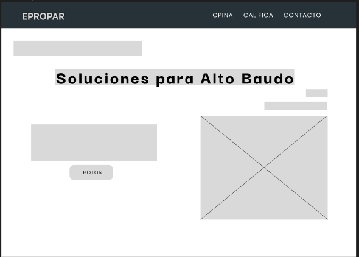
 
    </li> 
    <li><b>Segunda seccion:</b> Informara las opiniones ganadora del mes actual y se muestra la fecha del nuevo concurso.  
      

 
    </li> 
    <li><b>Tercera seccion:</b> Dedicada a destacar las primeras cuatro posiciones de las opiniones con mayor puntuacion.  
      
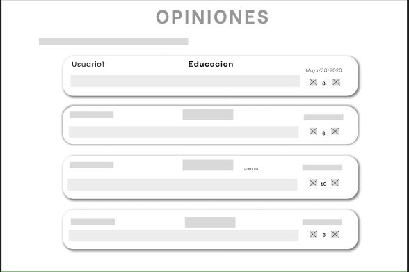 
 
    </li> 
    <li><b>Cuarta seccion:</b> Brinda informacion de los pasos a seguir para que el usuario pueda opinar y los pasos para que se pueda calificar. 
      

 
    </li> 
  </ul>

<b>PAGINA DE OPINIONES</b>

 Esta es una sub-página se encarga de mostrar las opiniones de los ciudadanos. Ofreciendo la oportunidad de posicionar los comentarios dependiendo de los "me gusta" dandos.

 

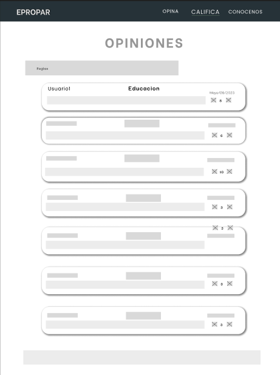

<b>PAGINA DEL FORMULARIO</b>

 Este formulario nos permite captar y almacenar la informacion del usuario, para luego mostrarla en la seccion de Opiniones.

 

<b>PAGINA DE CONOCENOS</b>

 La sub-pagina de Conocenos, se encarga de mostrar informacion relevante para los ciudadanos. Se habla de Quienes Somos, el proposito, las entidades asociadas, manejo del proceso de selecion y los datos disponibles para poderse comunicar con EPROPAR

 

<h3 align="center" >Modelo Mobile</h3>

<b>PAGINA PRINCIPAL - Mobile</b>

Nuestro diseño para dispositivos mobiles, es facil y simple de manejar. Abarcando las funciones importantes de la pagina y haciendo la interaccion mas agradable

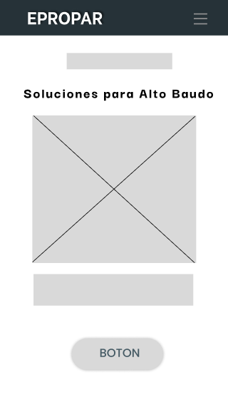    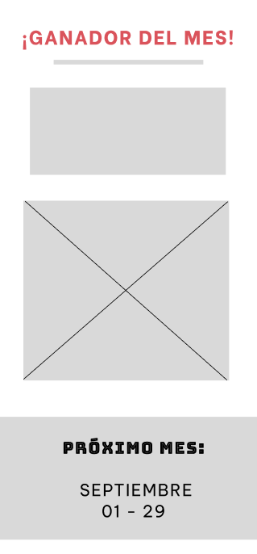    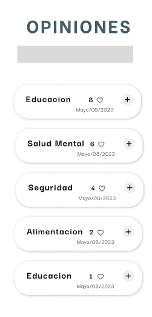    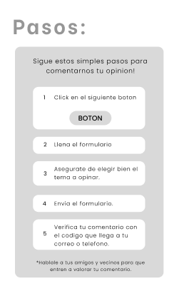    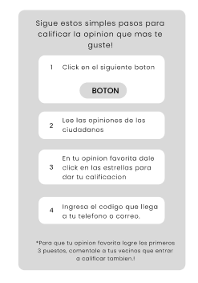

<b>PAGINA DE OPINIONES - Mobile</b>

La sub-pagina de Opiniones, mostrara todas los comentarios ingresadaos en la pagina web, ademas mostrara la fecha de posteo y la cantidad de "me gustas" recibidos. La opinion se podra acceder haciendo click en el icono +. 
 

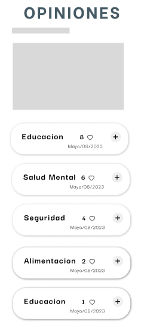

<b>PAGINA DEL FORMULARIO - Mobile</b>

 Este formulario que se adapta a los dispositivos mobiles, permitiendo el uso de la pagina con mas frecuencia.

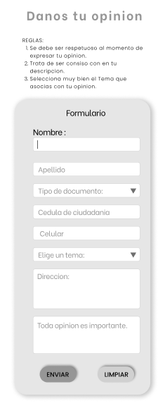

<b>PAGINA DE CONOCENOS - Mobile</b>

Toda pagina web debe tener una seccion de Conocenos, nuestro diseño en mobile permite que mas usuario conozcan sobre la entidad y tengan telefonos y correos para mejor comunicacion.

 
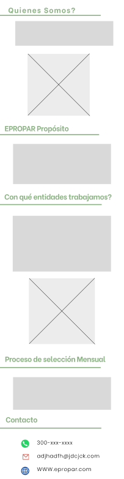

  
<h2 align="center"> Fuentes Utilizadas:</h2>
<ul>
  <li>[DANE (Departamento Administrativo Nacional de Estadística)](https://www.dane.gov.co/): Datos demográficos y estadísticas relevantes para comprender la situación en la región del Chocó.</li>
  <li>[El Nuevo Siglo](https://www.elnuevosiglo.com.co/): Fuente de noticias y análisis que proporciona información actualizada sobre asuntos locales y nacionales.</li>
</ul>
